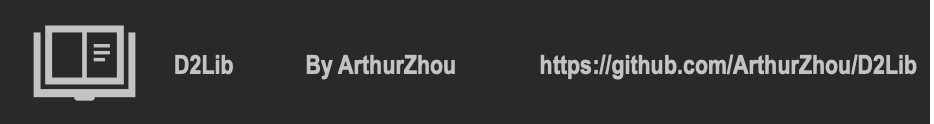

# Home
Welcome to D2Lib!

D2Lib(2 doc types' library) is an online library support *.html* files and *.md* files
***

[D2Lib on GitHub ](https://github.com/ArthurZhou/D2Lib)

## Info
Start your journey here
## Content
[What's new?](Update log.md)

[Readme](Readme.md)

[Plain text file](docs/txt.txt)

[rtf file](docs/rtf.rtf)

[jpg file](docs/favicon.jpg)

[mp4 file](docs/mp4.mp4)

[A *.html* example for this page](home.html)
